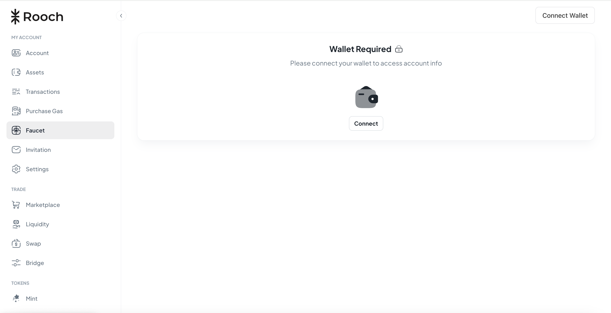
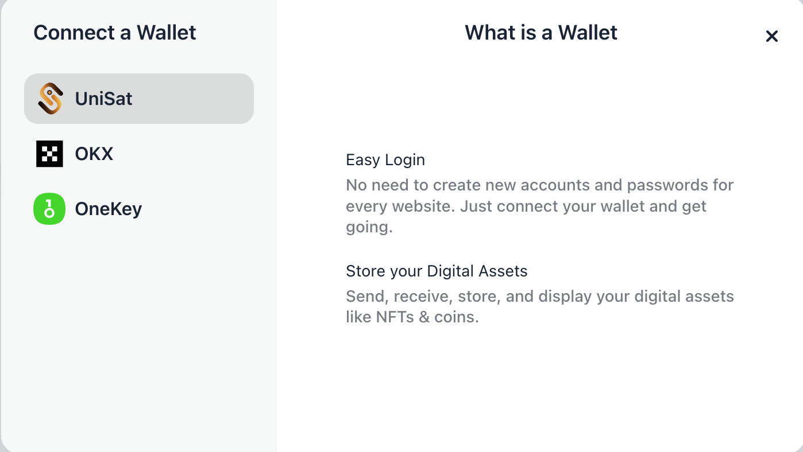
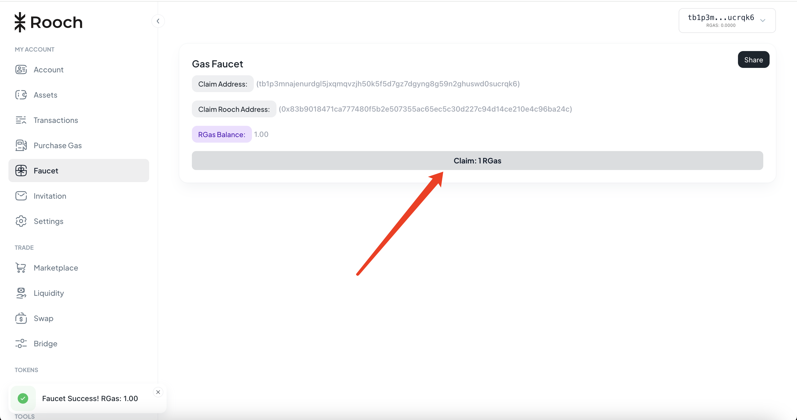

# 领取Rgas

RGas 主要用于支付 Rooch 网络上的交易费用。用户在执行交易时，需要消耗一定数量的 RGas 来支付计算和存储成本。

详细介绍：https://rooch.network/zh-CN/learn/core-concepts/rgas

### 步骤一：

访问url：https://test-portal.rooch.network/faucet

### 步骤二：

连接钱包，可以选择支持的三个钱包之一进行连接。

### 步骤三：

连接钱包后点击Claim: 1RGas 进行领取即可。

