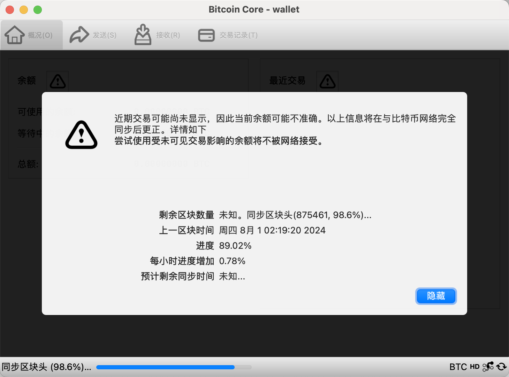
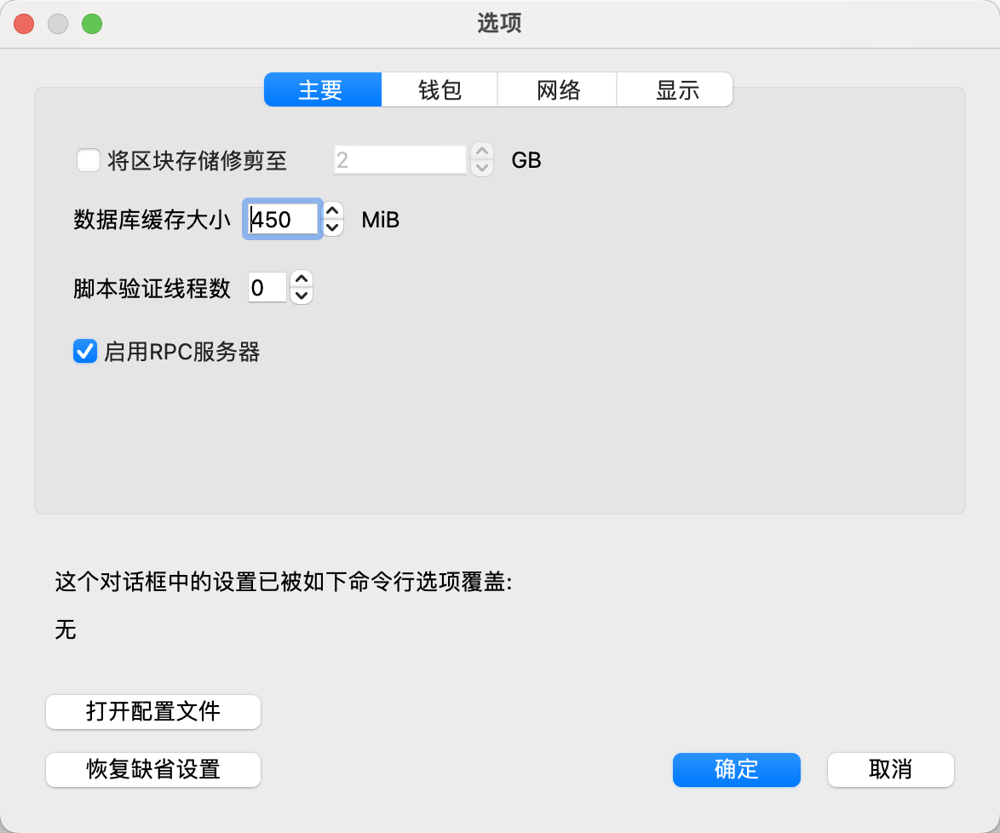
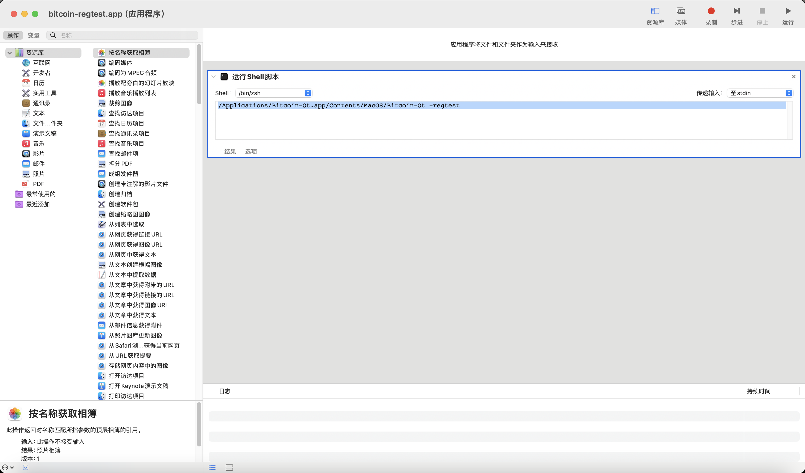
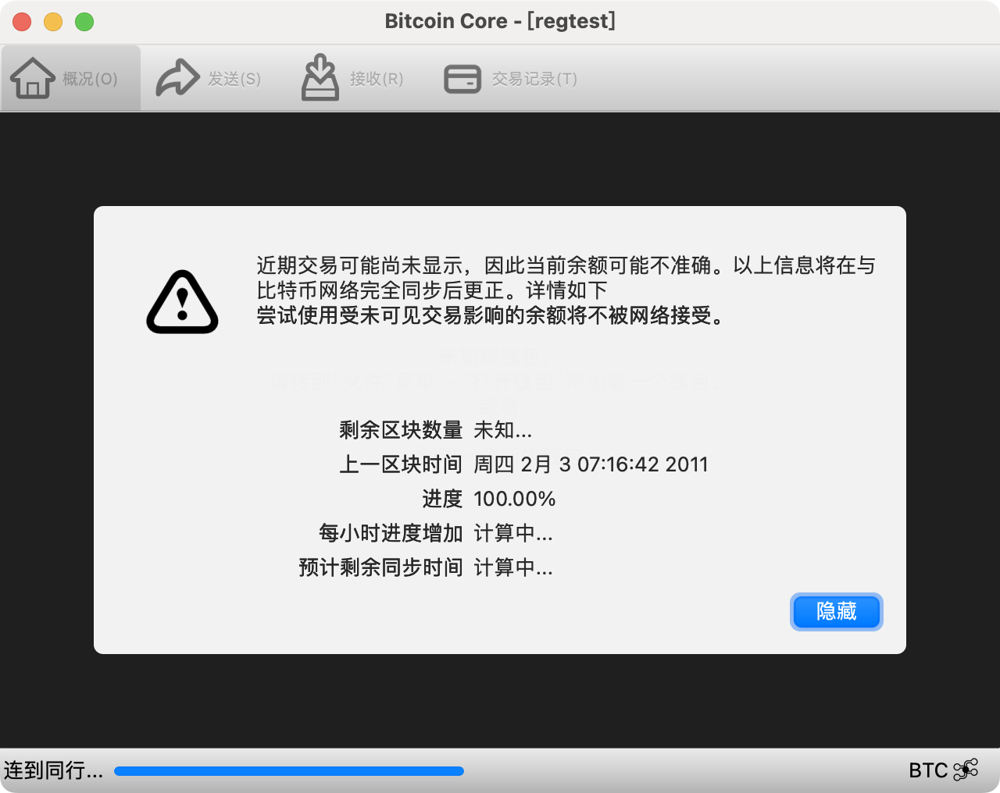
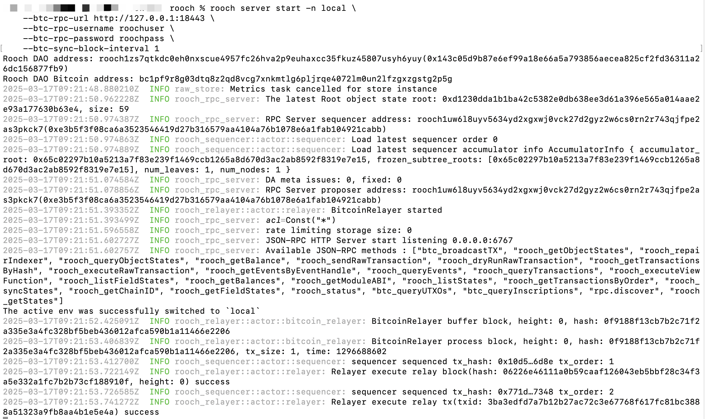

# rooch server
这一小节将给大家介绍如何使用 Rooch CLI 来运行本地开发环境。

当前版本，我们分别提供了 `rooch server start` 和 `rooch server clean` 命令来启动 Rooch 本地服务和清理服务器存储。
- **rooch server start**  


当我们编写完 Rooch Move 合约项目，我们需要启动 Rooch 开发环境来部署和测试合约。

```
rooch server start
Rooch DAO address: rooch1u2gret96h9nvcm4mkka2anygup6ch4cf4am6ljhd8ss5x3alp53stuzvrt(0xe2903cacbab966cc6ebbb5baaecc88e0758bd709af77afcaed3c214347bf0d23)
Rooch DAO Bitcoin address: bc1p9z34rs94s80pq5jv7tch3u4nk6vh60gh6w45x0ysad605nwwvd6qydc7vp
2025-03-17T09:27:32.569865Z  INFO raw_store: Metrics task cancelled for store instance
2025-03-17T09:27:33.043639Z  INFO rooch_rpc_server: The latest Root object state root: 0xc206f7dec61e6f7e797a2ff0dcc97ded13e4b48d6451f8fbae7066b9643e671f, size: 60
2025-03-17T09:27:33.046335Z  INFO rooch_rpc_server: RPC Server sequencer address: rooch1yeyk0vdj9k4xp95ppyywtuqdk8sy3rm3lc9qv0ys2lp08jl7suxqh8aryh(0x264967b1b22daa6096810908e5f00db1e0488f71fe0a063c9057c2f3cbfe870c)
2025-03-17T09:27:33.046518Z  INFO rooch_sequencer::actor::sequencer: Load latest sequencer order 0
2025-03-17T09:27:33.046534Z  INFO rooch_sequencer::actor::sequencer: Load latest sequencer accumulator info AccumulatorInfo { accumulator_root: 0x6281998bf4491035269064ece002ff1a344fa4850c8b05d87008ddec3be9a826, frozen_subtree_roots: [0x6281998bf4491035269064ece002ff1a344fa4850c8b05d87008ddec3be9a826], num_leaves: 1, num_nodes: 1 }
2025-03-17T09:27:33.064451Z  INFO rooch_rpc_server: DA meta issues: 0, fixed: 0
2025-03-17T09:27:33.065036Z  INFO rooch_rpc_server: RPC Server proposer address: rooch1yeyk0vdj9k4xp95ppyywtuqdk8sy3rm3lc9qv0ys2lp08jl7suxqh8aryh(0x264967b1b22daa6096810908e5f00db1e0488f71fe0a063c9057c2f3cbfe870c)
2025-03-17T09:27:33.090864Z  INFO rooch_rpc_server: acl=Const("*")
2025-03-17T09:27:33.094787Z  INFO rooch_rpc_server: JSON-RPC HTTP Server start listening 0.0.0.0:6767
2025-03-17T09:27:33.094845Z  INFO rooch_rpc_server: Available JSON-RPC methods : ["btc_broadcastTX", "rooch_getObjectStates", "rooch_repairIndexer", "rooch_queryObjectStates", "rooch_getBalance", "rooch_sendRawTransaction", "rooch_dryRunRawTransaction", "rooch_getTransactionsByHash", "rooch_executeRawTransaction", "rooch_getEventsByEventHandle", "rooch_queryEvents", "rooch_queryTransactions", "rooch_executeViewFunction", "rooch_listFieldStates", "rooch_getBalances", "rooch_getModuleABI", "rooch_listStates", "rooch_getTransactionsByOrder", "rooch_syncStates", "rooch_getChainID", "rooch_getFieldStates", "rooch_status", "rooch_checkChangeSets", "btc_queryUTXOs", "btc_queryInscriptions", "rpc.discover", "rooch_queryFields", "rooch_getStates"]
2025-03-17T09:27:33.099285Z  INFO rooch_rpc_server: rate limiting storage size: 0
The active env was successfully switched to `local`
```

- **本地测试网信息**  

  名称: local  
  ChainID: 4  
  RPC: http://localhost:6767  


- **rooch server clean**


如果有遇到服务数据冲突的问题，首先执行清除命令，再继续启动服务：

```
rooch server clean
Are you sure to clean the rooch data dir: "/root/.rooch/local" ?(Y/n)

Rooch storage "/root/.rooch/local" successfully cleaned
```

因为 Rooch 正处于快速开发迭代的过程，在部署合约时，可能会遇到兼容性问题，此时可以通过 `clean` 命令来清理旧的数据。

## Bitcoin本地开发环境

### **Linux 搭建**

- **docker 搭建**

可参考官方文章进行搭建：  
https://github.com/rooch-network/rooch/blob/main/scripts/bitcoin/README.md


### **MacOS 搭建**

- **非docker 搭建**

1、下载Bitcoin core

url: https://bitcoin.org/en/bitcoin-core/

安装后会进行区块同步



然后在配置里面启用RPC服务器



然后再编辑配置文件，内容如下：

```
[regtest]
rpcallowip=0.0.0.0/0
rpcbind=0.0.0.0
rpcport=18443

# 全局设置（适用于所有网络）
txindex=1
fallbackfee=0.00001

# ZeroMQ 配置（适用于所有网络）
zmqpubrawblock=tcp://0.0.0.0:28332
zmqpubrawtx=tcp://0.0.0.0:28333


# 如果您希望更快速地产生块，可设置自动生成
blockmintime=1  # 每秒生成一个块（仅测试用）

# 数据同步块间隔（可选）
minrelaytxfee=0.00001
# RPC 用户认证
rpcauth=roochuser:925300af2deda1996d8ff66f2a69dc84$681057d8bdccae2d119411befa9a5f949eff770933fc377816348024d25a2402
```

保存后进行自动操作创建，创建shell脚本方便后续使用。

```
/Applications/Bitcoin-Qt.app/Contents/MacOS/Bitcoin-Qt -regtest
```



然后保存后启动，可以看到带有regtest



然后启动rooch server

```
rooch server start -n local \
    --btc-rpc-url http://127.0.0.1:18443 \
    --btc-rpc-username roochuser \
    --btc-rpc-password roochpass \
    --btc-sync-block-interval 1
```

效果如下：



如果遇到启动失败的情况：

```
rooch server start -n local \
    --btc-rpc-url http://127.0.0.1:18443 \
    --btc-rpc-username roochuser \
    --btc-rpc-password roochpass \
    --btc-sync-block-interval 1
Rooch DAO address: rooch1zs7qtkdc0eh0nxscue4957fc26hva2p9euhaxcc35fkuz45807usyh6yuy(0x143c05d9b87e6ef99a18e66a5a793856aecea825cf2fd36311a26dc156877fb9)
Rooch DAO Bitcoin address: bc1pf9r8g03dtq8z2qd8vcg7xnkmtlg6pljrqe4072lm0un2lfzgxzgstg2p5g
2025-03-17T09:21:28.242791Z  INFO raw_store: Metrics task cancelled for store instance
2025-03-17T09:21:28.362761Z  INFO raw_store: Metrics task cancelled for store instance
2025-03-17T09:21:28.394338Z ERROR rooch_rpc_server: GenesisVersionMismatch { from_store: GenesisInfo { genesis_package_hash: 0x51994afb886d0e08681c36322d00d307d8183f2b43127894839b98c7da55caa1}, from_binary: GenesisInfo { genesis_package_hash: 0x1548ecd2e5bb55293ebaede860c1ea09cbfe925649e7fa7dce6015a917476d1d} }, please clean your data dir. `rooch server clean -n local` 
```

则需要运行`rooch server clean -n local` 进行清除本地缓存。

- **docker 搭建**

可参考官方文章进行搭建：  
https://github.com/rooch-network/rooch/blob/main/scripts/bitcoin/README.md

